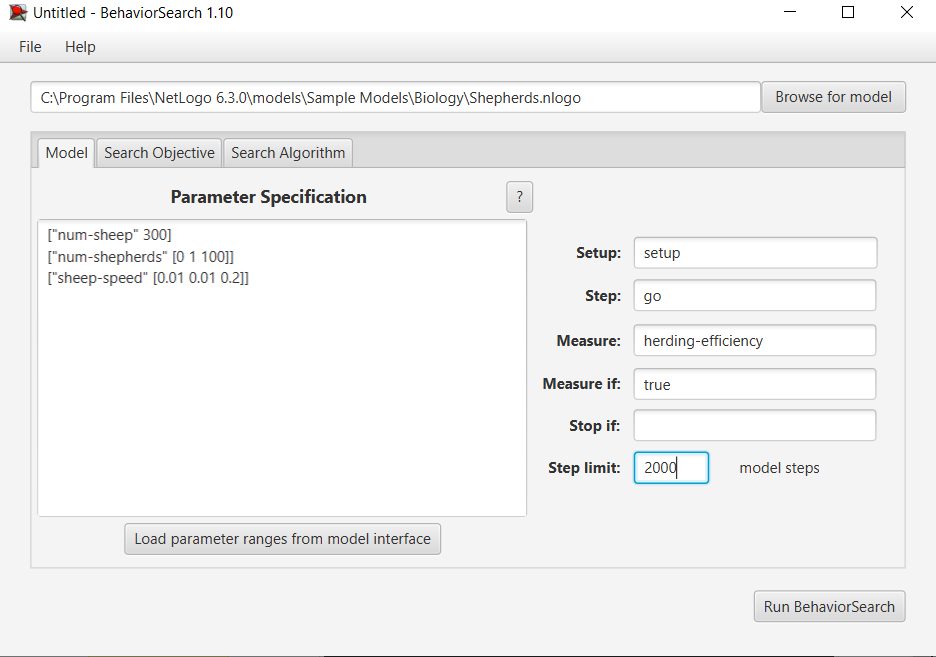
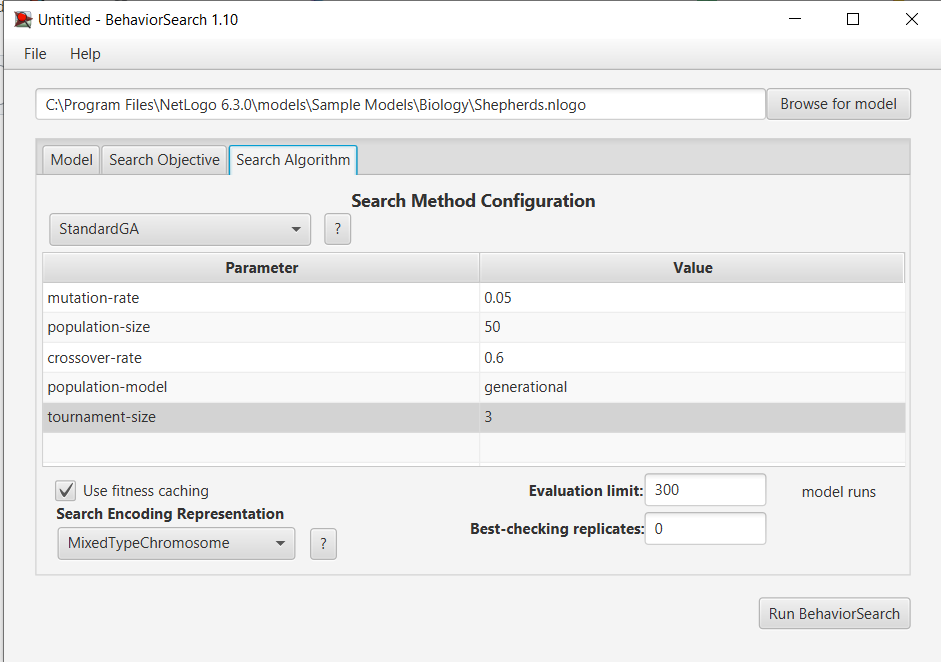
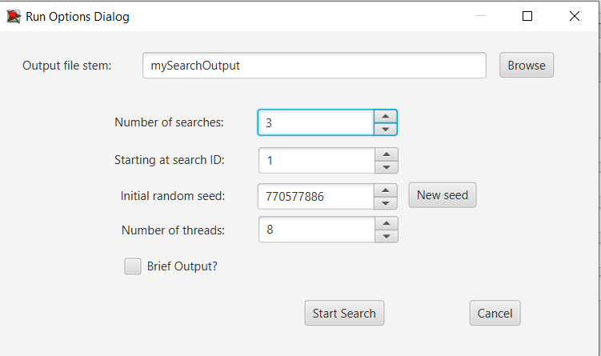
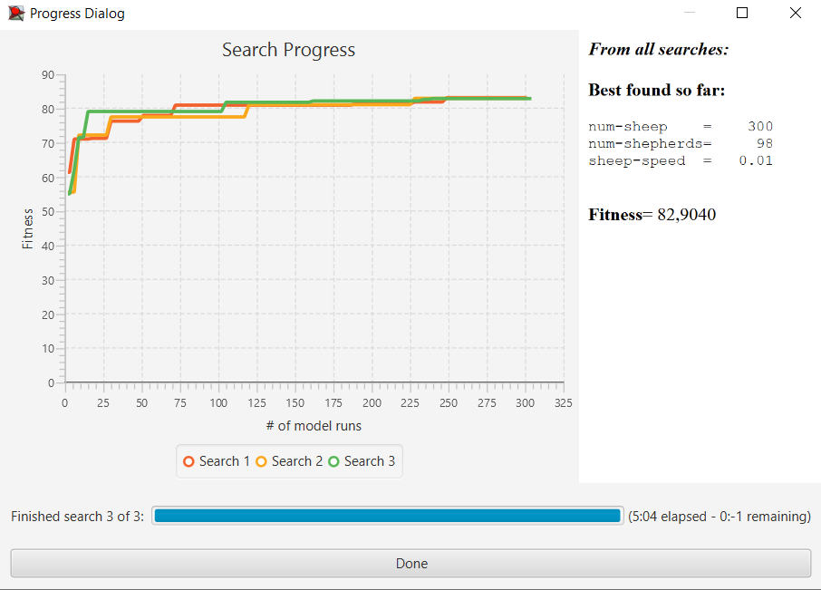
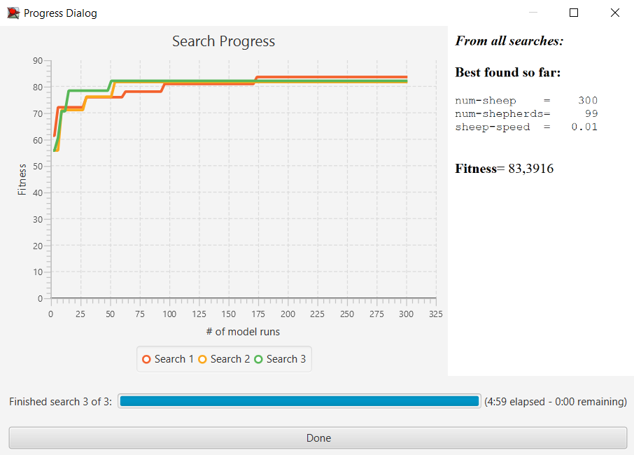

## Комп'ютерні системи імітаційного моделювання
## СПм-23-4, **Перетяка Євгеній Олександрович**
### Лабораторна робота №**3**. Використання засобів обчислювального интелекту для оптимізації імітаційних моделей

 

### Варіант 9, модель у середовищі NetLogo:

[Shepherds](http://www.netlogoweb.org/launch#http://www.netlogoweb.org/assets/modelslib/Sample%20Models/Biology/Shepherds.nlogo)

 

#### Вербальний опис моделі:

- **[Опис](../lab1)**
 

### Налаштування середовища BehaviorSearch:

**Обрана модель**:
<pre>
C:\Program Files\NetLogo 6.3.0\models\Sample Models\Biology\Shepherds.nlogo
</pre>

**Параметри моделі** (вкладка Model):  

<pre>
["num-sheep" 300]
["num-shepherds" [0 1 100]]
["sheep-speed" [0.01 0.01 0.2]]
</pre>
  
Використовувана **міра**:  
Для фітнес-функції  було обрано **значення ефективності випасання**. Вираз для її розрахунку взято з коду аналізованої імітаційної моделі в середовищі NetLogo:
<pre>
  globals
[
  sheepless-neighborhoods       ;; how many patches have no sheep in any neighboring patches?
  herding-efficiency            ;; measures how well-herded the sheep are
]
</pre>

та вказано у параметрі "Measure":
<pre>
mean [ speed ] of turtles
</pre>

Ефективність випасання повинна враховуватися **в середньому** за весь період симуляції тривалістю 2 000 тактів (адже на кожному такті є своє значення ефективності випасання), починаючи з 0 такту симуляції.  

Параметр зупинки за умовою ("**Stop if**") не використовувався.  
Загальний вигляд вкладки налаштувань параметрів моделі:  

**Налаштування цільової функції** (вкладка Search Objective):  
Метою підбору параметрів для показника **herding-efficiency** є **максимізація** ефективності випасання - це вказано через параметр "**Goal**" зі значенням **Maximize Fitness**. Тобто необхідно визначити такі параметри налаштувань моделі, за яких досягається найвища ефективність випасання. При цьому цікавить результат не у якийсь окремий момент симуляції, а середнє її значення за всю симуляцію (тривалість якої 2 000 тіків). Для цього у параметрі "**Collected measure**", що визначає спосіб обліку значень обраного показника, вказано **MEAN_ACROSS_STEPS**.  
Щоб уникнути викривлення результатів через випадкові значення, що використовуються в логіці самої імітаційної моделі, **кожна симуляція повторюється по 3 рази**, результуюче значення розраховується як **середнє арифметичне**.
Загальний вигляд вкладки налаштувань цільової функції:  

**Налаштування алгоритму пошуку** (вкладка Search Algorithm):  

Загальний вид вкладки налаштувань алгоритму пошуку:

 

### Результати використання BehaviorSearch:
Діалогове вікно запуску пошуку *(можна залишити за замовчуванням, але стежте, куди пишеться результат)*:

Результат пошуку параметрів імітаційної моделі, використовуючи **генетичний алгоритм**:  

Результат пошуку параметрів імітаційної моделі, використовуючи **випадковий пошук**:  

